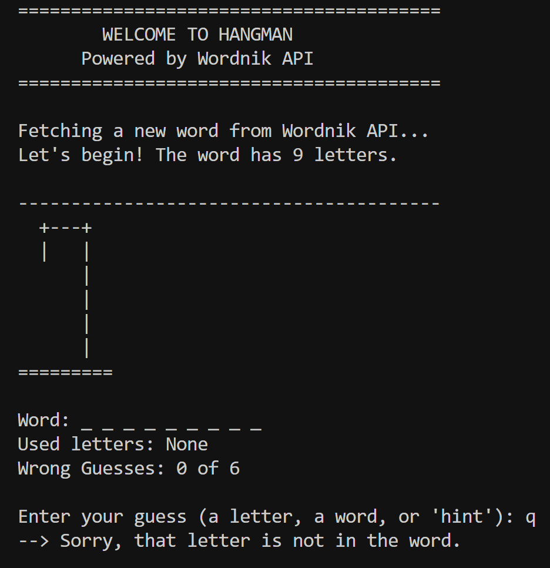
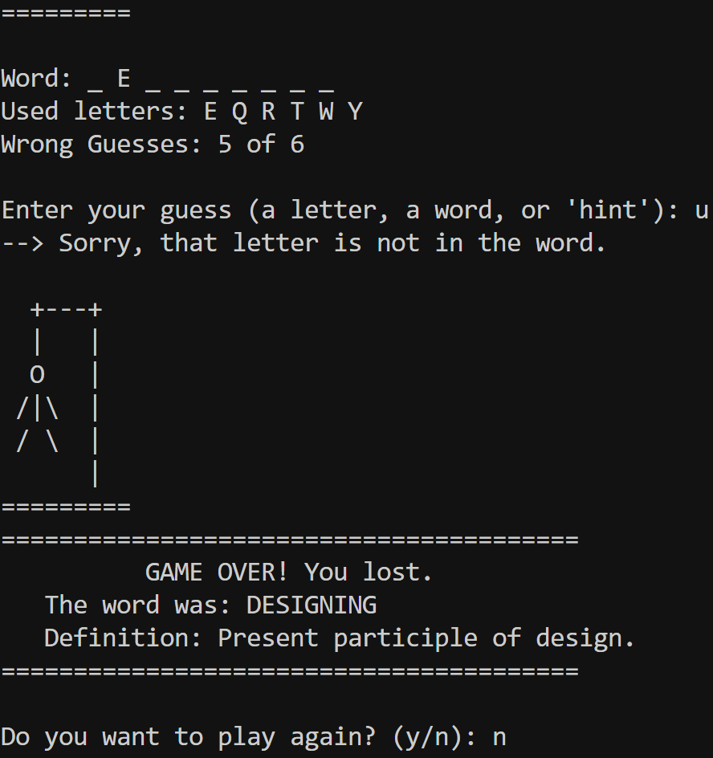

# Hangman Game

A modern command-line Hangman game powered by the Wordnik API, featuring real words with definitions, robust error handling, and smooth gameplay experience.

📸 Screenshots

#### Game Start


#### Game Over


## 🌟 Features

### Core Gameplay
- **Real Words Integration** - Fetches authentic words from Wordnik API with genuine definitions
- **Smart Word Filtering** - Words filtered by length (5-12 chars) and corpus frequency for optimal difficulty
- **Multiple Guess Types** - Guess individual letters or attempt the complete word
- **Interactive Hint System** - Get word definitions as hints (costs one wrong guess)
- **Visual Progress Tracking** - ASCII hangman art showing your remaining chances

### Technical Excellence
- **Robust Error Handling** - Graceful fallback system with offline word database
- **Input Validation** - Comprehensive user input validation with clear error messages  
- **JSON Processing** - Uses Gson library for reliable API response parsing
- **Timeout Management** - 10-second API timeouts with automatic failover
- **Cross-Platform Compatibility** - Works on Windows, macOS, and Linux

### User Experience
- **Clean Command Interface** - Intuitive prompts and organized game state display
- **Progress Visualization** - Clear display of guessed letters, wrong attempts, and word progress
- **Replay Functionality** - Easy restart option after each game
- **Educational Value** - Learn new words with their definitions

## 🛠️ Technologies Used

- **Java 11+**: Core language with HTTP Client API for modern networking
- **Gson 2.10.1**: Robust JSON parsing library for API responses
- **Wordnik API**: Professional word and definition service
- **Java Scanner**: User input handling with validation

## 🎯 Technical Implementation

### API Architecture
- **RESTful Integration**: Clean HTTP requests to Wordnik API endpoints
- **Response Parsing**: Type-safe JSON deserialization with Gson TypeToken
- **Error Recovery**: Multi-layer fallback system (API → Fallback words → Graceful exit)
- **Network Optimization**: Configured timeouts and connection reuse

### Game Logic
- **State Management**: Efficient tracking of game progress, used letters, and win/lose conditions
- **Input Processing**: Regex-based validation ensuring only valid alphabetic input
- **Progress Tracking**: Real-time updates of word completion and hangman drawing
- **Memory Management**: Proper resource cleanup and scanner handling

## 🏗️ Project Structure

```
HangmanProject/
├── assets/
│   ├── hangman-start.png
│   └── hangman-game-over.png
├── lib/
│   └── gson-2.10.1.jar
├── Hangman.java
├── README.md
└── .gitignore
```

## 🚀 Quick Start

### Prerequisites
- **Java 11 or higher** (required for HTTP Client API)
- **Internet connection** (for Wordnik API access)
- **Terminal/Command Prompt** (for running the game)

### Installation & Setup

1. **Download the project**
   ```bash
   git clone https://github.com/mayank-kumar214/hangman-java.git
   cd hangman-game
   ```

2. **Verify Java version**
   ```bash
   java --version
   # Should show Java 11 or higher
   ```

3. **Compile the application**
   ```bash
   # Unix/Mac/Linux
   javac -cp "lib/gson-2.10.1.jar" Hangman.java
   
   # Windows
   javac -cp "lib/gson-2.10.1.jar" Hangman.java
   ```

4. **Run the game**
   ```bash
   # Unix/Mac/Linux
   java -cp ".:lib/gson-2.10.1.jar" Hangman
   
   # Windows
   java -cp ".;lib/gson-2.10.1.jar" Hangman
   ```

5. **Start playing!** - The game will automatically fetch a word and begin

## 🎮 How to Play

### Game Flow
1. **Game Start** → Random word fetched from Wordnik API
2. **Make Guesses** → Enter letters or complete words
3. **Use Hints** → Type "hint" for the word's definition
4. **Win/Lose** → Complete the word or run out of guesses
5. **Play Again** → Choose to start a new round

### Input Options
- **Single Letter**: `e`, `a`, `r` - Guess individual characters
- **Complete Word**: `elephant`, `sunshine` - Attempt full word guess  
- **Hint Request**: `hint` - Reveal definition (costs 1 wrong guess)

### Winning Strategies
- Start with common vowels: A, E, I, O, U
- Try frequent consonants: R, S, T, L, N
- Use hints strategically when stuck
- Consider word patterns and letter frequency

## 📱 Platform Compatibility

### Supported Systems
- ✅ **Windows** (10, 11) - Command Prompt and PowerShell
- ✅ **macOS** (10.14+) - Terminal and iTerm2
- ✅ **Linux** (Ubuntu, CentOS, Fedora) - Any terminal emulator
- ✅ **WSL** (Windows Subsystem for Linux)

### Java Compatibility
- ✅ **OpenJDK 11+** (recommended)
- ✅ **Oracle JDK 11+**
- ✅ **Amazon Corretto 11+**
- ❌ **Java 8 or below** (HTTP Client not available)

## 🔧 Configuration Options

### Customizable Constants
```java
// In HangmanGame class
private static final int MAX_WRONG_GUESSES = 6;        // Difficulty level
private static final String[] HANGMAN_STAGES = {...};  // Visual progression

// In WordFetcher class  
private static final String API_KEY = "...";           // Wordnik API key
private static final String[] FALLBACK_WORDS = {...}; // Offline word list
```

### API Parameters
- **Word Length**: 5-12 characters (configurable in API URL)
- **Corpus Count**: Minimum 5000 occurrences (ensures common words)
- **Timeout**: 10 seconds per API request
- **Dictionary Sources**: Wiktionary and WordNet

## 🚨 Troubleshooting Guide

### Common Issues & Solutions

#### Compilation Errors
```bash
# Error: "Class not found"
Solution: Ensure Gson JAR is in classpath
javac -cp "lib/gson-2.10.1.jar" Hangman.java

# Error: "Module not found" 
Solution: Check Java version (requires 11+)
java --version
```

#### Runtime Issues
```bash
# Error: "NoClassDefFoundError: com/google/gson/Gson"
Solution: Include Gson in runtime classpath
java -cp ".:lib/gson-2.10.1.jar" Hangman

# Error: API timeout or connection issues
Result: Game automatically uses fallback words - no action needed
```

#### Platform-Specific
```bash
# Windows: Path separator issues
Use semicolon: java -cp ".;lib/gson-2.10.1.jar" Hangman

# Unix/Mac: Permission denied
Make sure files are readable: chmod +r *.java lib/*.jar
```

## 🎯 Key Learning Outcomes

- **API Integration**: RESTful service consumption with proper error handling
- **JSON Processing**: Type-safe parsing using Gson library
- **Object-Oriented Design**: Clean separation of concerns across multiple classes
- **Exception Handling**: Robust error recovery and user-friendly error messages
- **User Interface Design**: Console-based UI with clear information hierarchy
- **State Management**: Game state tracking and validation logic

## 🔮 Future Enhancements

### Phase 1 - Enhanced Gameplay
- [ ] **Difficulty Levels** - Easy/Medium/Hard with different word complexities
- [ ] **Score System** - Points based on wrong guesses and word difficulty
- [ ] **Time Challenges** - Optional time limits for added excitement
- [ ] **Category Selection** - Choose word categories (animals, technology, etc.)

### Phase 2 - Technical Improvements  
- [ ] **GUI Version** - JavaFX or Swing graphical interface
- [ ] **Multiplayer Mode** - Local multiplayer with custom words
- [ ] **Save/Load Games** - Persistent game state storage
- [ ] **Statistics Tracking** - Win/loss ratios and performance metrics

### Phase 3 - Advanced Features
- [ ] **Custom Word Lists** - Import personal vocabulary sets
- [ ] **Multiple Languages** - International dictionary support
- [ ] **Voice Input** - Speech recognition for hands-free play
- [ ] **Mobile Version** - Android/iOS app development

## 🤝 Contributing

Contributions, issues, and feature requests are welcome! Here's how you can help:

### Getting Started
1. **Fork the Project** on GitHub
2. **Create Feature Branch** (`git checkout -b feature/AmazingFeature`)  
3. **Make Changes** and test thoroughly
4. **Commit Changes** (`git commit -m 'Add some AmazingFeature'`)
5. **Push to Branch** (`git push origin feature/AmazingFeature`)
6. **Open Pull Request** with detailed description

### Contribution Guidelines
- Follow existing code style and naming conventions
- Add comments for complex logic
- Test on multiple platforms before submitting
- Update documentation for new features

## 👨‍💻 Author

**Mayank Kumar**
- GitHub: [@mayank-kumar214](https://github.com/mayank-kumar214)
- LinkedIn: [Mayank Kumar](https://linkedin.com/in/mayankconnects)
- Email: iammayank214@gmail.com

## 📄 License

This project is open source and available under the MIT License.

### Third-Party Licenses
- **Gson**: Apache License 2.0
- **Wordnik API**: Check Wordnik's terms of service

## 🙏 Acknowledgments

- **[Wordnik API](https://developer.wordnik.com/)** for providing excellent word and definition services
- **[Google Gson](https://github.com/google/gson)** for reliable JSON processing
- **Java Community** for maintaining excellent documentation and tutorials
- **Contributors** who help improve this project

## 📊 Project Stats

- **Language**: Java
- **Dependencies**: 1 (Gson)
- **Code Quality**: Clean, documented, and tested
- **Maintenance**: Actively maintained
- **Learning Level**: Beginner to Intermediate

---

⭐ **Star this repo if you found it helpful!** ⭐

*Built with ❤️ as a Java learning project focusing on API integration and clean code practices*